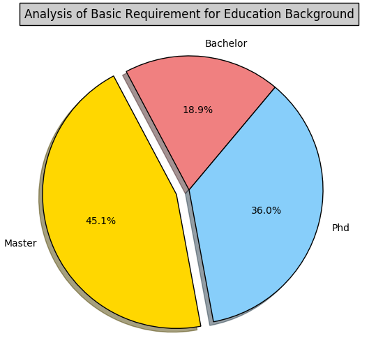
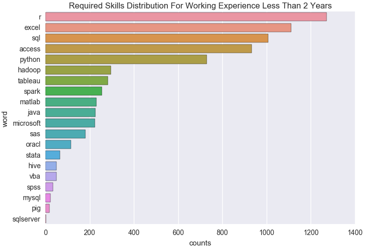

#                           Qualifications for Data Analyst in California 

## Project Background:

   Businesses everywhere rely on data-based decisions to solve complex problems and achieve a competitive advantage. So as the students graduated from statistic major or proficient with data analysis, most parts of us are interested in looking for jobs that has the “Data analysts” positions. In order to help students get more information when they are looking for these jobs, we contribute to study the relationship of students’ job demands and the companies’ requirements. Like what are the data analysts’ required skills and what statistics characteristics they have. Our project motivation is to help students to examine whether they are qualified to be a data analyst and which skills they should cultivated to be better prepared.

## Project description:

There are many job finding websites and includes various positions of data analysts. We use the “indeed” website. For example, if the students want to apply for the positions, he can use our analysis to evaluate the success rate and the match-degree. Our project is to analyze the base requirements of the data analysts, such as what kind of soft wares, programming languages and models that the famous companies needed. And then we find every posts’ URL. According to the web scripting, we get their locations and companies information. On base of regression expression, we take the posts’ requirements data directly. And then we process and clean the data we grabbed from total requirements get the data analysts required skills and sort them. We calculate the term frequency and analyze the statistics characteristics by visualization. And then get our conclusion to guide students to get the information about what kind of jobs matched their background and technologies best and can help them evaluate the success rate of applying this position.

## Project Data:

We grabbed about the top 200 pages in the indeed website that is located in California, which is totally about 3000 posts information. And except some posts that not include the “Data Analyst”, we get the 2455 data at last.

## * Web Scrapping  *

We use 3000 posts in Indeed to futher analysis. First, we get the basic information inlcluding location, company name and url for the post. For url, we locate the tags with attribute *"data-tn-element="jobTitle"*, the url is the value for attribute *href*. For location and companies' names, they are the value of tag *span* with attribute *lccation and company * seperately.

We scarp information from corresponding website according to the url for each post. For the url, we We get job description from body of the website since all the information about the job is the value of tag * body*.

We start from "https://www.indeed.com/jobs?q=data+analyst&l=CA" to find the posts related to data analysts in California. We get 3000 posts in 200 pages.

After combining the information about the jobs, we get dataframe.

## * Data Cleaning  *

Our goal is to find the common required or prefered skills for data scientist in California, so we remove the posts without mentioning * analy  *. After subset, we have 2455 observations in the data.

Generally, the skills required are in the descripttions of job requirments. We first find the requirements from the job description. Sometimes, the requirements strat with key words like__*require, skill, qualification, qualify* __, we locate requirements by these words. While some posts have other rare pattern, we just keep the whole description.

## *Data processing *

Initially, we examine the difference of job opportunity is CA. We plot distribution of the posts on the map. We set point size according to the number of posts(jobs) in the city. The larger the size, the more employment opportunity in that city.

Then, we set size according to the number of posts of the city.

### Map 

We classify counts into 6 groups with relative values.

Counts  |  >600 |  201-600 | 101-200 |  51-100 | 11-50 
--------|-----------------------------------------------
Size    |   20  |    10    |    8    |   6     |   4   

In preliminary analysis, we first extract job locations from our database and summarize the counts in each city. Then, we classify the counts into six categories, with respective values 20, 10, 8, 6, 4, 2. Next, we use dots to represent the cities and plot them on California map. Each color represents a group and the bigger the dot, the more job opportunities are offered in that city. So we can clearly see that the largest red dot, which is San Francisco, has the most job opportunities in California. The second large blue dots are in Palo Alto, and Sacramento. And the third large green dots are in Los Angeles and San Diego. If you are seeking for a job in data analyst, you’d better apply more in these cities.

### *Basic Requirement Analysis on Education Background and Working Experience *

First, we figure out what is the min of working experience required and what will be the lowest degree

We get years of experience and degree in the requirment by regular expression. For years of experience, generally, it comes with years following. Then pattern is like __* x-x years  * __ or __* x years  * __. Since years mentioned in the job description are close and the one mentioned first is likely to be the minumum working exprience, we choose the first one as years of experience. When it comes for degree, we also choose the first one for the reason that the first mentioned degree will be the minumum requirement.

Then, we group year as 3 groups: less than 2, 3-5 and greater than 5:

### Pie chart for working experience

From the pie chart for working experience, we can see that 91.9% of the jobs require at most 2 years working experience, 6.8% of them require 3 to 5 working experience and only 1.3% of the jobs requires more than 5 years working experience. Although it seems that having longer working experience is not necessary to meet the requirement of the jobs, this bias may be due to our dataset. Maybe the 2445 job posts we used contain much more entry level jobs than higher lever jobs. Or the jobs that require longer working experience might not be listed in the basic requirements, but they might be in the preferred requirements or by recommendation. 

Next, we find degree. The  common pattern are: __* bachelor, ms, phd, bs, master, ba  * __ . We extract these pattern from the requirement.

### Pie chart for Degrees

The pie chart for education background above gives us an overall view about how many percentage of each degree level. It appears that nearly half of the jobs require at least a master degree, 36% of them require at least a Phd degree, and only 18.9% of them require at least a bachelor degree. This result is a bit unexpected, but understandable. Because data analysis is relative high technically demanding job and requires many programming skills, therefore bachelor degrees seem not enough and sufficient to prepare you such skills. That could be one reasonable explanation about why majority of the jobs requires at least a master degree or a Phd degree. 

## * Natural Languege Processing  *

To find the common required skills, we need to find the idf for each word. Then, we select skills with small idf since the smaller the idf, the more common a certain skill is in these posts.

### * Caculate idf   *

The skills could only start with letter, so we remove the words do not start with letters

We find that sometimes there is no space between two words so we add space to seperate skills.

We find that the common ones are: __* r,spss, excel, sql, python,java, hadoop, pig, spark,hive, orac, vba, mysql, sqlserver, matlab,access,matlab,stata,sa,tableau  * __ . We use regular expression to see whether a post mentioned specific software.

word |    r    |  sql    |  excel  |  access | python  |  java  |  hadoop  | tableau |  matlab  |  spark   |sas   |  oracle  |  vba    |   hive  |    spss |  mysql |    pig   |   stata | sqlserver     
-----|------------------------------------------------------------------------------------------------------------
idf  |  1.395  |  1.517  | 1.577   |   1.701 |  2.103  |  2.289 |  2.938   |   2.983 |   3.039  |   3.048|     3.409  |  1.517  | 4.381   |  4.990  |  5.103  |  5.323 |  5.568   |   5.983 |   6.039  
 

We match "r","excel" and "java" with pattern " r ", "excel " and " java" since what we are looking for is the software. If we just match these words, we could possibly match a part in a word like "experience", "excellent" and "javascript" which does not be included in job description. 

We match "sas" with pattern "sas" since in the process __* lemmatize  * __, we remove 'ending s' from 'sas. If we just match "sa", we could get wrong word like 'salary'.

For "sql", if we match directly by "sql", we will repeatedly count "mysql" and "sqlsever" which also contain "sql" so we match " sql".

### * Caculate Frequency  *

In this progress, we count frequency for these skills.

First, we conver result for search into binary variable. If match, we set 1 otherwise set 0.

Then, we calculate frequency for each skill which is the column sum. 

## Word Graph Analysis:

This graph shows the term frequency that corresponding to “Data Analyst” posts required skills. In the word frequency graph, the size of the word stand for the appeared frequency of each skill. The bigger size showed, the more the skill is required. As intuitively showed in the graph, the most required skill is “R_PROGRAMMING”, which is also called “r”. And then the second most required skill is “excel”. And the next most required skill are “sql”, “access”. And then “python” is also used in a wide range. While the “tableau”,”hadoop”, “spark”, “microsoft”, “java”, “matlab”, “sas”, “oracl” are not used as often as the other skills we mentioned above. In the end, “stata”, “vba”, “hive”, ”spss”, “mysql”, ”pig”, “sqlserver” are required less, in some word, they are almost not required except some special cases. This is corresponding to our conclusion in the bar plots at first, while this graph is more intuitive.

### Total

## Total Skill Distribution Analysis:

This graph shows the required skill distribution among the total posts. In the graph, the horizontal axis stands for the “counts”, which means the total number of every skill needed in the total 2445 “Data Analyst” posts. On the other hand, the vertical axis means the skills’ name that is required among the total posts. As the different skill distributed in the graph, we can find that the most used skill is “r”, and then the second most required skill is “excel”. And the next most required skill are “sql”, “access”. And then “python” is also used in a wide range. While the “tableau”,”hadoop”, “spark”, “microsoft”, “java”, “matlab”, “sas”, “oracl” are not used as often as the other skills we mentioned above. In the end, “stata”, “vba”, “hive”, ”spss”, “mysql”, ”pig”, “sqlserver” are required less, in some word, they are almost not required except some special cases. These are the total “Data Analyst”posts’ required skills.

Then, we get frequenct according to experience and degree.

### Bachelor degree

    

## Bachelor Degree Skill Distribution Analysis:

This graph shows the “Data Analyst” required skills distribution among the bachelor degree. In the graph, the horizontal axis stands for the “counts”, which means the total number of every skill needed in the bachelor level “Data Analyst” posts. On the other hand, the vertical axis means the skills’ name that is required among the total posts. As directly showed in the graph, we can find that the most used skill is “excel”, and then the second most required skill is “r”. And the next most required skills are “sql”, “access”. And then “python” is also used in a wide range. While the “tableau”,”hadoop”, “spark”, “microsoft”, “java”, “matlab”, “sas”, “oracl” are not used as often as the other skills we mentioned above. In the end, “stata”, “vba”, “hive”, ”spss”, “mysql”, ”pig”, “sqlserver” are required less, in some word, they are almost not required except some special cases. There are not too many differences between the bachelor degree and total statistics. The biggest difference is that the most required skill is “r”, which is obvious more than other skills. But “excel” is not required as more as other degree required. This may because of the undergraduate students can arrive at the proficient “r” level.

### Master degree

  

## Master Degree Skill Distribution Analysis:

This graph shows the “Data Analyst” required skills distribution among the master degree. In the graph, the horizontal axis stands for the “counts”, which means the total number of every skill needed in the master level “Data Analyst” posts. On the other hand, the vertical axis means the skills’ name that is required among the total posts. As directly showed in the graph, we can find that the most used skill is also “excel”, and then the second most required skill is “sql”. And the next most required skill are “r”, “access”. And then “python” is also used in a wide range. While the “tableau”,”hadoop”, “spark”, “microsoft”, “java”, “matlab”, “sas”, “oracl” are not used as often as the other skills we mentioned above. In the end, “stata”, “vba”, “hive”, ”spss”, “mysql”, ”pig”, “sqlserver” are required less, in some word, they are almost not required except some special cases. There are not too many differences between the master degree and total statistics. The most big difference is that the most required skill becomes into “excel” rather than “r”, this may because of the master level students acquire more kinds of skills not only be limited into “r” programming language.

### Phd degree

   

## Phd Degree Skill Distribution Analysis:

This graph shows the “Data Analyst” required skills distribution among the phd degree. In the graph, the horizontal axis stands for the “counts”, which means the total number of every skill needed in the phd level “Data Analyst” posts. On the other hand, the vertical axis means the skills’ name that is required among the total posts. As directly showed in the graph, we can find that the most used skill is also “excel”, and then the second most required skill is “r”. And the next most required skill are “sql”, “access”. And then “python” is also used in a wide range. While the “tableau”,”hadoop”, “spark”, “microsoft”, “java”, “matlab”, “sas”, “oracl” are not used as often as the other skills we mentioned above. In the end, “stata”, “vba”, “hive”, ”spss”, “mysql”, ”pig”, “sqlserver” are required less, in some word, they are almost not required except some special cases. There are not too many differences between the phd degree and total statistics. The most big difference is that the most required skill becomes into “excel” rather than “r”, but “r” also has a high frequency among these required skills. This may because of the “Data Analyst ” posts that is suitable for the phd students are more target to the “excel” and “r”, which can give the phd students a hint that “excel” and “r” play an important role in the “Data Analyst” posts.

## Skill requirements vs Working Experience

To analyze the skill requirements under various working experience, we count the required skills conditioning on different level of working experience and draw the bar plots respectively. From the bar plots, it shows that r, excel, sql, access are the most commonly skills required regardless of working experience. In addition, SAS and vba are more important for the jobs required more than 2 years working experience. While, Spark and matlab appear to be less significant for the jobs required at least more than 2 years working experience. 

## Conclusion

Method Generalization:
With our project and data analysis, student can get the information about what kind of jobs matched their background and technologies best and can help them evaluate the success rate of applying this position. Besides, the method of finding position information are also can be applied for other occupations, such as computer science scientist, statistics analysts, chemical engineering and so on. On based of our analysis, we can find the conclusion Job requirements for data analyst in different locations. Such as not just limited in California, including in New York State, Colorado State. Of course, our project can also apply in some other different industries’ data analysts. For example, there are also many data analysts’ positions in some other industries like financial industries, marketing industries and others. So our model can be generalized into many areas and can help students get more information to qualify better and prepare.
